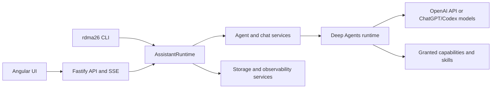
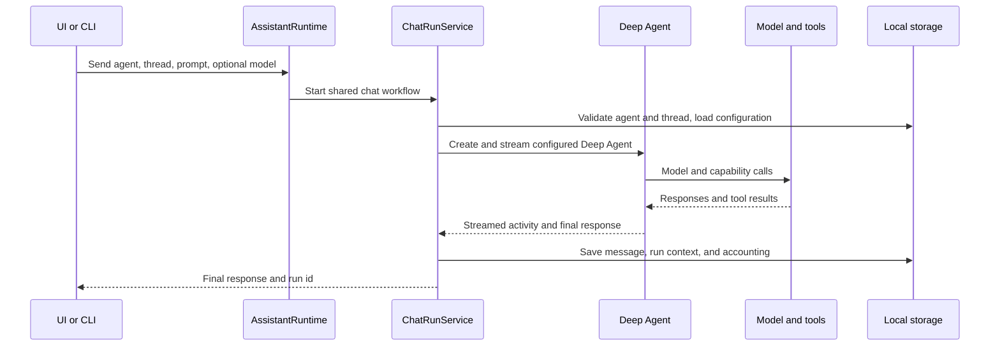
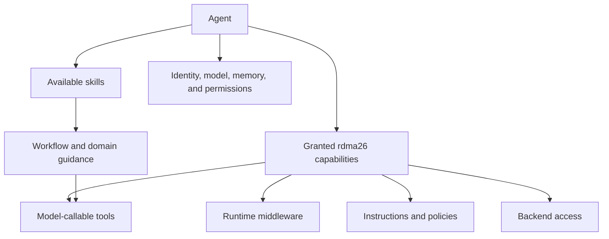

# Architecture

This document describes the implemented rdma26 architecture on the current
branch. Product direction and future acceptance criteria are defined in
[vision.md](./vision.md).

## System Shape

rdma26 is a local-first application with three interfaces over one backend
runtime:

The Angular frontend does not contain model credentials, filesystem access, or
Deep Agents runtime behavior. HTTP routes and CLI commands delegate to the same
`AssistantRuntime` methods.

## Frontend

The Angular application uses standalone components, signals, routing, Tailwind
CSS, and shared API contracts.

Major user surfaces include:

- agent and thread selection;
- streamed chat runs;
- agent identity, model, tool, and memory settings;
- user profile and theme settings;
- long-term memory management;
- run-context inspection;
- LLM usage, pricing, and estimated costs.

The frontend treats the backend as the source of truth for shared profile,
agent, thread, memory, and observability data. Local storage is limited to
client-side convenience and synchronization behavior.

## Backend Runtime

`server/src/runtime.ts` composes the application services. It owns the shared
operations exposed through HTTP and CLI, including:

- agent lifecycle and configuration;
- thread lifecycle;
- chat runs;
- long-term memory CRUD and retrieval;
- profile synchronization;
- capability grants;
- run-context inspection;
- LLM call and cost queries;
- pricing and pricing-source management.

Fastify routes validate HTTP input and call this runtime. The CLI parses command
arguments and calls the same runtime directly.

## Agent Runtime

Each chat run creates a configured Deep Agent on the backend. The configuration
includes:

- the selected accounting-aware model;
- the agent's generated system prompt and `soul.md` identity;
- configured application capabilities and the tools, middleware, and
  instructions they contribute;
- built-in Deep Agents tools, middleware, and skills;
- scoped memory backends and permissions;
- the persistent LangGraph checkpointer.

Agents are stored separately by id. Threads belong to exactly one agent. Model,
capability, memory permission, identity, and chat visibility settings are
agent-specific.

The protected `scotty` operator receives controlled application administration
tools. It does not receive unrestricted shell access. The internal
`cost-analyst` agent receives controlled cost and pricing tools and has
long-term memory disabled.

## Chat Run Flow

LangGraph checkpoints preserve the Deep Agent state for a thread. The
application database separately stores messages as a UI/API/CLI read model.

## Capabilities, Tools, And Skills

rdma26 uses these terms for different architectural layers. They are related,
but they are not interchangeable.

| Concept        | Definition                                                                                                                                                        | Deep Agents representation                                                                                             |
| -------------- | ----------------------------------------------------------------------------------------------------------------------------------------------------------------- | ---------------------------------------------------------------------------------------------------------------------- |
| **Capability** | A user-configurable agent ability and authorization boundary. It is an rdma26 application concept, not a model-callable operation.                                | A configured combination of tools, middleware, system instructions, backend access, or permissions.                    |
| **Tool**       | One concrete operation that the model can choose to call. Its name, description, and input schema form a model-visible interface.                                 | A LangChain tool, provider-hosted server tool, MCP tool, or built-in harness tool.                                     |
| **Skill**      | A reusable package of workflow guidance, domain knowledge, and supporting resources. It teaches the agent how to approach work but does not authorize operations. | A Deep Agents-compatible skill directory containing `SKILL.md` and optional scripts, references, templates, or assets. |

The boundaries follow these rules:

- A capability is configurable when it represents a meaningful ability,
  permission, security boundary, provider dependency, or cost boundary. A new
  capability is not needed for every individual function.
- One capability may contribute one tool, several tools, middleware,
  instructions, backend configuration, or a combination of them.
- Not every tool belongs to a configurable capability. Deep Agents harness
  tools, memory tools controlled by memory permissions, and administration tools
  injected for protected agents can be available without a normal capability
  grant.
- A skill may explain when and how to combine tools, but loading a skill never
  grants a capability or bypasses a permission.
- Middleware is an implementation mechanism rather than a separate user-facing
  agent feature.
- Identity, model selection, conversation state, and memory configuration remain
  separate from capabilities, tools, and skills.

This model complements Deep Agents rather than replacing its terminology. Deep
Agents uses _capabilities_ broadly when describing features of its agent harness,
while its concrete configuration mechanisms are tools, middleware, skills,
backends, and permissions. rdma26's capability is the stable product-level grant
that resolves into one or more of those mechanisms. See the official Deep Agents
[overview](https://docs.langchain.com/oss/javascript/deepagents/overview),
[tools](https://docs.langchain.com/oss/javascript/deepagents/tools), and
[skills](https://docs.langchain.com/oss/javascript/deepagents/skills)
documentation.

Current examples illustrate the relationship:

- The `web_search` capability adds search guidance and OpenAI's provider-hosted
  `web_search` tool to the selected model. See [research.md](./research.md).
- The `interpreter` capability adds QuickJS middleware, interpreter guidance,
  and the `eval` tool. See [interpreter.md](./interpreter.md).
- `read_web_page` and `read_web_page_structure` currently map directly from
  individual configurable entries to tools.
- Protected administration tools are injected by agent role and are not normal
  configurable capabilities.
- Memory tools are exposed according to the agent's memory read and write
  permissions, not through ordinary capability grants.

The current persistence model, API routes, CLI commands, and agent editor still
use names such as `enabledTools` and **Tools** for the configurable capability
list. That is legacy terminology in the present implementation; it should be
aligned with this model across all interfaces rather than preserved as a second
product concept.

## Memory And Context

The model-visible context combines the rdma26 bootloader, Deep Agents runtime
instructions, current-thread state, pinned memory, available tool definitions,
and any tool results added during the run. Its exact sources, ordering,
on-demand expansion, and compaction are documented in
[context-window.md](./context-window.md).

Long-term memory storage, scopes, retrieval, and controls are documented in
[memory.md](./memory.md).

## Models And Accounting

Chat models and embedding requests are created through accounting-aware
factories or adapters. Call records include model, purpose, agent, thread, run,
tokens, timing, and pricing snapshots where available.

The public OpenAI API and experimental subscription-backed ChatGPT/Codex path
are separate providers. The latter is limited to Codex model calls; embeddings
and hosted web search remain API-key-only. See
[OpenAI ChatGPT/Codex provider](./architecture/openai-chatgpt-provider.md).

This makes chat, maintenance, and embedding work separately inspectable. See
[observability.md](./observability.md).

Behavioral changes to prompts, tools, memory retrieval, delegation, or context
construction are measured with the versioned harness documented in
[evaluation.md](./evaluation.md).

## Storage

rdma26 uses:

- `.assistant-data/rdma26.sqlite` for application records and derived indexes;
- `.assistant-data/langgraph-checkpoints.sqlite` for LangGraph thread state;
- agent configuration and memory files under `.assistant-data/agents/`;
- global user memory under `.assistant-data/user/`.

See [storage.md](./storage.md) for ownership and lifecycle details.

## Current Architectural Boundaries

- The backend is local-first and currently designed for one authenticated user.
- OpenAI API and experimental ChatGPT/Codex access are implemented as separate
  model providers.
- OpenAI hosted web search is the implemented search provider.
- The QuickJS interpreter is available as an agent capability; a general
  execution sandbox is not yet enabled.
- Mobile access, multimodality, broad file work, and controlled script execution
  are long-term directions, not current features.
