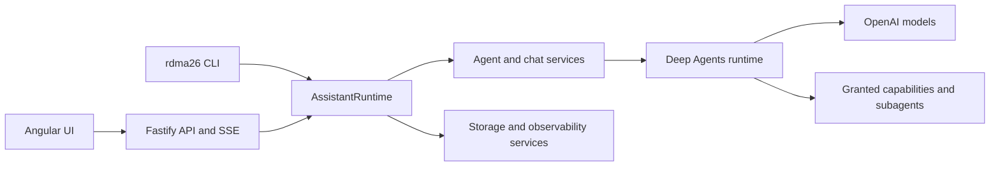
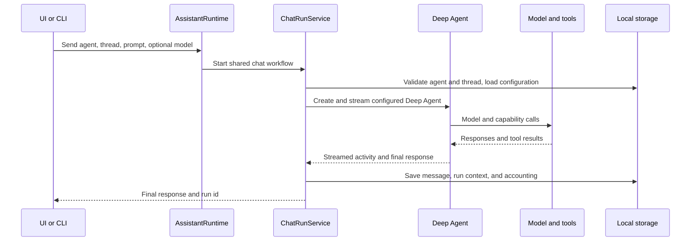

# Architecture

This document describes the implemented rdma26 architecture on the current
branch. Product direction and future acceptance criteria are defined in
[vision.md](./vision.md).

## System Shape

rdma26 is a local-first application with three interfaces over one backend
runtime:

The Angular frontend does not contain model credentials, filesystem access, or
Deep Agents runtime behavior. HTTP routes and CLI commands delegate to the same
`AssistantRuntime` methods.

## Frontend

The Angular application uses standalone components, signals, routing, Tailwind
CSS, and shared API contracts.

Major user surfaces include:

- agent and thread selection;
- streamed chat runs;
- agent identity, model, tool, and memory settings;
- user profile and theme settings;
- long-term memory management;
- run-context inspection;
- LLM usage, pricing, and estimated costs.

The frontend treats the backend as the source of truth for shared profile,
agent, thread, memory, and observability data. Local storage is limited to
client-side convenience and synchronization behavior.

## Backend Runtime

`server/src/runtime.ts` composes the application services. It owns the shared
operations exposed through HTTP and CLI, including:

- agent lifecycle and configuration;
- thread lifecycle;
- chat runs;
- long-term memory CRUD and retrieval;
- profile synchronization;
- capability grants;
- run-context inspection;
- LLM call and cost queries;
- pricing and pricing-source management.

Fastify routes validate HTTP input and call this runtime. The CLI parses command
arguments and calls the same runtime directly.

## Agent Runtime

Each chat run creates a configured Deep Agent on the backend. The configuration
includes:

- the selected accounting-aware model;
- the agent's generated system prompt and `soul.md` identity;
- granted application tools;
- enabled Deep Agents subagents;
- scoped memory backends and permissions;
- skills;
- the persistent LangGraph checkpointer.

Agents are stored separately by id. Threads belong to exactly one agent. Model,
capability, memory permission, identity, and chat visibility settings are
agent-specific.

The protected `scotty` operator receives controlled application administration
tools. It does not receive unrestricted shell access. The internal
`cost-analyst` agent receives controlled cost and pricing tools and has
long-term memory disabled.

## Chat Run Flow

LangGraph checkpoints preserve the Deep Agent state for a thread. The
application database separately stores messages as a UI/API/CLI read model.

## Capabilities And Subagents

The capability registry owns application capabilities and their configuration
requirements. Normal capabilities can be granted or revoked per agent.
Protected capabilities are injected only for their system agent.

The current `research` capability attaches a Deep Agents researcher subagent.
That subagent has web-search and page-reading tools and returns structured
source-backed findings. Its current limitations and planned simplification are
documented in [research.md](./research.md).

## Memory And Context

The runtime keeps distinct context layers:

1. `soul.md` for stable agent identity;
2. skills for reusable instructions;
3. LangGraph checkpoint state for the current thread;
4. scoped Markdown files for curated long-term memory;
5. stored past conversations searched on demand.

Long-term memory details are documented in [memory.md](./memory.md).

## Models And Accounting

Chat models and embedding requests are created through accounting-aware
factories or adapters. Call records include model, purpose, agent, thread, run,
tokens, timing, and pricing snapshots where available.

This makes parent-agent, subagent, maintenance, and embedding work separately
inspectable. See [observability.md](./observability.md).

Behavioral changes to prompts, tools, memory retrieval, delegation, or context
construction are measured with the versioned harness documented in
[evaluation.md](./evaluation.md).

## Storage

rdma26 uses:

- `.assistant-data/rdma26.sqlite` for application records and derived indexes;
- `.assistant-data/langgraph-checkpoints.sqlite` for LangGraph thread state;
- agent configuration and memory files under `.assistant-data/agents/`;
- global user memory under `.assistant-data/user/`.

See [storage.md](./storage.md) for ownership and lifecycle details.

## Current Architectural Boundaries

- The backend is local-first and currently designed for one authenticated user.
- OpenAI is the implemented model provider.
- Tavily is the implemented search provider.
- The researcher is useful but still too prescriptive and is scheduled for
  redesign against the stable evaluation set.
- A general Deep Agents interpreter or sandbox is not yet enabled.
- Mobile access, multimodality, broad file work, and controlled script execution
  are long-term directions, not current features.
