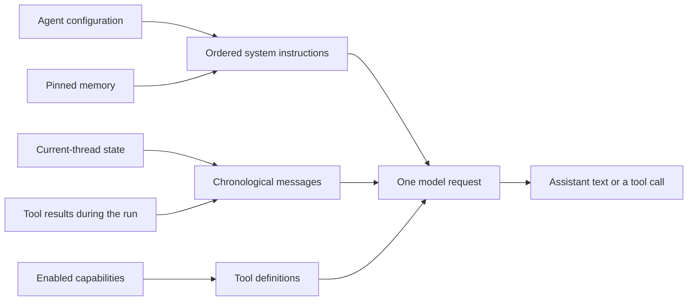
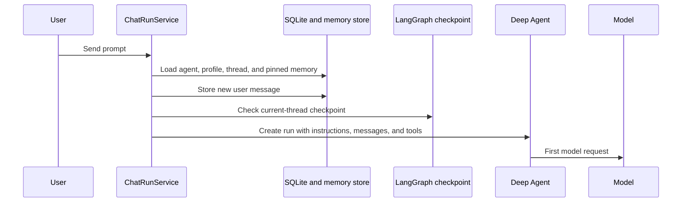
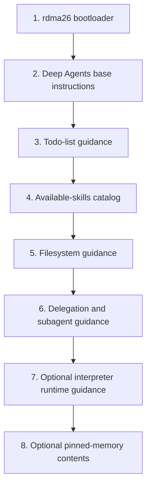
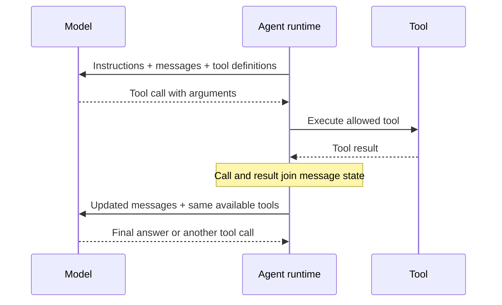
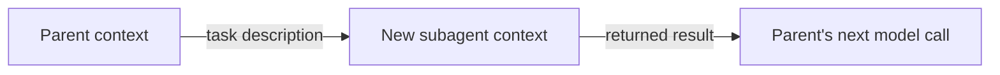
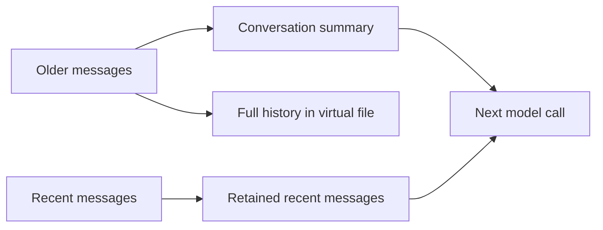

# Agent Context Window

An agent can only respond to information that is available in its **context
window**. In rdma26, this is not one permanent document and it is not a copy of
everything the application knows. It is the working input sent to a model for
one model call.

That distinction matters because rdma26 stores more information than it sends
to the model at once:

- User and assistant messages are stored in SQLite. The model receives the
  conversation state of the **current thread**. Normally this contains its
  messages in chronological order; in a very long thread, older parts may have
  been replaced by a summary. Conversations from other threads remain stored
  until the agent retrieves one with a tool.
- Long-term memories are stored as scoped Markdown files. **Pinned** memories
  are loaded automatically; unpinned memories remain on disk until the agent
  searches for them.
- Installed skills have `SKILL.md` files. At first, the model receives only a
  catalog with each skill's name, description, and file path. The full content
  of a skill is loaded only if the agent reads that file.
- An enabled capability adds capability-specific instructions, tool
  definitions, or both to the model request. This generated content is part of
  the context window and consumes tokens; the capability setting itself is not
  inserted as text. A tool definition explains what the tool does and which
  input it accepts, and it remains in the context even if the tool is never
  used. Data produced by the tool, such as search results or a calculation,
  enters the conversation state only after the agent calls it.

rdma26 therefore loads a focused set of information at startup and gives the
agent tools for finding more when it is needed.

Capabilities, tools, and skills are distinct architectural concepts. Their
canonical definitions and their mapping to Deep Agents are documented in
[Capabilities, Tools, And Skills](./architecture.md#capabilities-tools-and-skills).
This document focuses only on the content each mechanism contributes to a model
request.

This document describes the current implementation. It explains what is loaded,
in which order, what is only available on demand, and what happens when the
context becomes too large.

## The Short Version

Every model call has three main inputs:

1. **System instructions** tell the model who the agent is, how rdma26 works,
   and which runtime rules apply.
2. **Messages** contain the effective current-thread conversation and any tool
   calls or results produced so far in the run.
3. **Tool definitions** describe the tools that the model is allowed to call.

The exact provider request format can differ, but these three groups together
consume the model's context window.

The input is rebuilt for every model call. If the model calls a tool, the tool
result becomes part of the message state and the next model call therefore has
different context.

## Stored, Available, And Loaded

It helps to separate three ideas:

| State     | Meaning                                                  | Example                                                       |
| --------- | -------------------------------------------------------- | ------------------------------------------------------------- |
| Stored    | rdma26 has persisted the information.                    | An old conversation is in SQLite.                             |
| Available | The agent has a tool that can retrieve it.               | `search_past_conversations` can find an old thread.           |
| Loaded    | The actual content is visible to the model in this call. | A retrieved conversation excerpt is present as a tool result. |

Only **loaded** content is in the context window. This prevents every past
conversation, memory, source page, and skill from being copied into every model
request.

## How A Run Starts

When the user sends a prompt, `ChatRunService` prepares the run before the first
model call:

1. It loads the selected agent, the agent's `soul.md`, the user profile, the
   selected model, capability settings, and memory permissions.
2. If memory reads are enabled, it loads the agent's applicable pinned memories.
3. It constructs the allowed application tools from the enabled capabilities
   and permissions.
4. It saves the new user message to the SQLite thread.
5. It checks whether LangGraph already has a checkpoint for this thread.
6. It creates the Deep Agent with the assembled instructions, tools, memory
   paths, backend, and checkpointer.

SQLite and the LangGraph checkpoint have different jobs. SQLite is rdma26's
durable conversation record and supplies the UI. The checkpoint is the agent
runtime's working state for that thread.

- **No checkpoint yet:** rdma26 sends the complete current SQLite thread to the
  agent.
- **Checkpoint exists:** LangGraph restores the previous runtime state, so
  rdma26 sends only the newly stored user message.

In both cases, the model should see the effective current-thread messages in
chronological order without rdma26 duplicating the old messages on every run.

## System Instructions: Current Order

The system instructions are assembled in layers. The following is their current
logical order with the installed Deep Agents runtime (`deepagents` 1.10.7).
Provider adapters may serialize these instructions differently, but later
sections do not replace the earlier ones.

### 1. rdma26 bootloader

rdma26 creates the first, product-specific part of the system instructions. Its
content is ordered as follows:

1. Agent name and the stable-identity path.
2. Protected operator guidance, when the agent has that role.
3. The complete contents of the agent's `soul.md`.
4. User display preferences: name, timezone, language, locale, date style, time
   style, and the current local date and time.
5. Shared conversation-continuity rules.
6. General guidance for using enabled tools.
7. Capability-specific guidance, when enabled, in this order: web search, web
   page reading, and interpreter.
8. Memory-write rules, or an explanation that memory writes are disabled.
9. Long-term-memory rules for pinned memory, unpinned memory, and past
   conversations.
10. General response guidance about practicality, conversation style, and
    uncertainty.

The current local date and time are generated anew for each run. `soul.md` is
loaded in full rather than retrieved through a tool.

### 2-6. Deep Agents runtime instructions

The Deep Agents SDK adds its general operating instructions. These currently
cover planning with todos, the virtual filesystem, skills, and delegation to a
general-purpose subagent.

For skills, only a catalog containing each skill's name, description, and
`SKILL.md` path is loaded initially. The full skill instructions enter the
conversation only if the agent reads that file. This is progressive disclosure:
the agent knows what skills exist without paying the context cost of every skill
body.

### 7. Interpreter runtime guidance

When the interpreter capability is enabled, the QuickJS middleware adds its own
runtime instructions and the `eval` tool. This is in addition to rdma26's earlier
guidance about when the interpreter should be used.

### 8. Pinned memory

When memory reads are enabled, the Deep Agents memory middleware appends the
contents of all applicable pinned memory files. These are the only long-term
memories loaded automatically into every run for that agent.

Pinned memory has a bounded character budget. Unpinned memory does not silently
join this section. See [Memory](./memory.md) for scopes, storage, retrieval, and
user controls.

## Messages In The First Model Call

After the system instructions, the model receives the effective current-thread
message state in chronological order. On a normal first call of a run, this
means:

1. Earlier user and assistant messages from the same thread, restored from the
   checkpoint or supplied from SQLite.
2. The newest user message.

Messages from other agents or other threads are not included. Past conversations
can only enter through the dedicated search and read tools.

The stored message timestamps and IDs are useful to rdma26 but are not added to
the ordinary model message text. The user profile and current time are already
represented in the system instructions instead.

## Tool Definitions

The model also receives the definitions of every tool available for this run.
A definition includes the tool's name, description, and input schema. It uses
context even if the tool is never called.

Depending on the agent configuration, the tool set can include:

- application capability tools, such as web-page reading;
- provider-hosted web search;
- memory and past-conversation tools;
- protected operator tools;
- Deep Agents tools for todos, virtual files, and subagents;
- the `eval` tool when the interpreter is enabled.

The current virtual filesystem backend does not provide shell execution. The
presence of filesystem instructions therefore does not give the model access to
the host shell or arbitrary local files.

## What Enters During A Run

The first model response may be final text, or it may request a tool. A tool call
adds both the assistant's call and the tool's result to the current message
state. The agent then calls the model again with that expanded state.

This is how on-demand information reaches the context window:

| Information               | How it becomes loaded                                                                  |
| ------------------------- | -------------------------------------------------------------------------------------- |
| Unpinned long-term memory | The agent calls `search_unpinned_memory`.                                              |
| An old conversation       | The agent calls `search_past_conversations`, then optionally `read_past_conversation`. |
| A complete skill          | The agent calls `read_file` for its `SKILL.md`.                                        |
| Current web information   | The agent calls hosted web search or a web-reading tool.                               |
| Calculation output        | The agent calls `eval` when the interpreter is enabled.                                |
| Subagent work             | The parent calls `task`, then receives the subagent's returned result.                 |

The model can make several calls in one user-visible run. Consequently, there is
no single context snapshot that describes the entire run; each LLM call has its
own composition.

## What Is Not Loaded Automatically

The following information may be stored or reachable, but is not copied into
every model call:

- unpinned long-term memories;
- conversations from other threads;
- conversations belonging to other agents;
- full bodies of all installed skills;
- web pages and search results that have not been requested;
- application settings unrelated to the run;
- the UI's run details, cost footer, and source presentation;
- the complete host filesystem, environment variables, or credentials.

This boundary is intentional. It controls context size and prevents unrelated
agent or conversation data from leaking into a run.

## Subagent Context

A delegated subagent does not receive a full copy of the parent's conversation.
It starts with its own subagent instructions, the delegated task description,
its allowed tools, and the applicable skill catalog. Its final result returns to
the parent as a tool result and then becomes visible in the parent's next model
call.

This keeps delegation focused, but it also means the task description must carry
the details the subagent needs.

## When The Context Becomes Large

Deep Agents applies summarization middleware before the context reaches the
model's maximum size. With the current installed version, it uses the selected
model's profile when available and normally starts compacting at about 85% of
the input limit. If no usable profile exists, the SDK has a conservative
fallback threshold. A provider context-overflow error can also trigger emergency
summarization.

Compaction summarizes older messages and retains a recent portion of the
conversation. The complete offloaded history is stored in the agent's virtual
filesystem so the agent can read it when necessary. Large tool results and very
large user messages can also be offloaded, leaving a preview and a virtual-file
reference in the active message state.

These thresholds and transformations come from the Deep Agents SDK rather than
an rdma26-specific context policy. They can change when the dependency is
upgraded.

## Inspecting A Real Run

The run-details page records the inputs rdma26 prepared, including the soul,
user profile, current-thread messages, pinned memories, enabled tools, withheld
capabilities, tool calls, and LLM calls.

Each recorded LLM call also has a context-composition summary with message counts
and character counts by role, plus tool-definition counts and sizes. This is the
best view for comparing successive model calls in one run.

There is one important limitation: **System prompt diagnostics currently
describe only the rdma26 bootloader.** They do not reproduce the final combined
system instructions after all Deep Agents middleware has added its sections.
The LLM-call composition totals measure the effective request more broadly, but
the UI does not currently display a complete reconstructed context window.

## Source Map

These files are the main implementation sources for the behavior described
above:

| Area                                                   | Source                                          |
| ------------------------------------------------------ | ----------------------------------------------- |
| Run preparation, tools, pinned memory, and checkpoints | `server/src/chat/chat-run-service.ts`           |
| Agent creation and Deep Agents configuration           | `server/src/agents/personal-agent.ts`           |
| rdma26 bootloader and its internal order               | `server/src/agents/agent-prompt.ts`             |
| Interpreter middleware                                 | `server/src/agents/agent-middleware.ts`         |
| Memory search and write tools                          | `server/src/capabilities/memory-tools.ts`       |
| Past-conversation tools                                | `server/src/capabilities/conversation-tools.ts` |
| Per-call context composition accounting                | `server/src/llm/llm-accounting-callback.ts`     |
| Persisted run details                                  | `server/src/chat/chat-run-recorder.ts`          |

The Deep Agents base instructions, skills catalog, filesystem behavior,
subagents, pinned-memory injection, and summarization are supplied by the
installed `deepagents` package. When that dependency changes, this document and
the resulting run context should be reviewed together.
