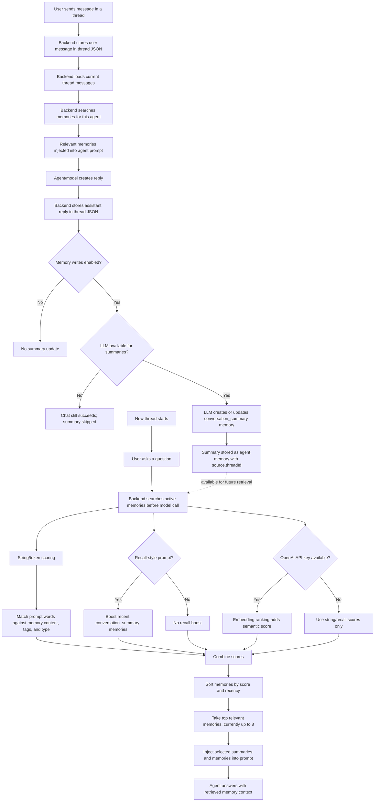

# Memory System

This document describes how the `rdma26` memory system works today.

The design/specification history is preserved in [memory-spec.md](./memory-spec.md). This file is the practical implementation reference for developers and operators.

## Purpose

The memory system lets an agent remember useful information across threads without loading every old conversation into the model context.

It supports:

- explicit memories created by the user, UI, CLI, API, or agent tool
- automatic thread-summary memories after chat runs
- manual and scheduled memory maintenance
- relevant memory retrieval for future chat runs
- run-context transparency so the user can inspect what was loaded

`soul.md` is not general memory. It is the agent identity file. General facts, preferences, summaries, tasks, and tracked topics belong in memory records.

## Storage Layout

All memory data is local-first under `.assistant-data`.

```text
.assistant-data/
  agents/
    <agent-id>/
      configuration/
        soul.md
      memories/
        <memory-id>.json
      threads/
        <thread-id>.json
      deepagent/
  user/
    memories/
      <memory-id>.json
  memory-index/
    openai-embeddings.json
  memory-maintenance-settings.json
  runs/
    <run-id>.json
```

Important paths:

- Agent identity: `.assistant-data/agents/<agent-id>/configuration/soul.md`
- Agent memory records: `.assistant-data/agents/<agent-id>/memories/`
- Global user memory records: `.assistant-data/user/memories/`
- Embedding cache: `.assistant-data/memory-index/openai-embeddings.json`
- Maintenance schedule: `.assistant-data/memory-maintenance-settings.json`
- Run-context snapshots: `.assistant-data/runs/`

The backend code for long-term memory lives mainly in:

- `server/src/memory-store.ts`
- `server/src/tools/memory-tools.ts`
- `server/src/runtime.ts`
- `server/src/memory-maintenance-settings-store.ts`
- `server/src/memory-maintenance-scheduler.ts`
- `server/src/run-context-store.ts`

## Memory Record Model

A memory record is a JSON object with this shape:

```json
{
  "id": "00000000-0000-0000-0000-000000000000",
  "scope": "agent",
  "agentId": "scotty",
  "type": "fact",
  "status": "active",
  "lifetime": "active",
  "content": "The user prefers concise status updates.",
  "tags": ["preference"],
  "source": {
    "agentId": "scotty",
    "threadId": "00000000-0000-0000-0000-000000000001",
    "note": "Saved by agent during chat run."
  },
  "createdAt": "2026-07-08T10:00:00.000Z",
  "updatedAt": "2026-07-08T10:00:00.000Z"
}
```

### Scopes

`agent`

Memory that belongs to one agent. It is stored under `.assistant-data/agents/<agent-id>/memories/`.

`agent_user`

Memory about the user that is relevant only for one agent. It is also stored under `.assistant-data/agents/<agent-id>/memories/`.

`user`

Global user memory that can be relevant to all agents. It is stored under `.assistant-data/user/memories/`.

### Types

`fact`

A durable fact that may be useful later.

`preference`

A user preference or expectation.

`conversation_summary`

A compact summary of a thread or important conversation.

`open_task`

Something still active.

`tracked_topic`

A topic the agent may need to follow over time.

### Status

`active`

Available for retrieval.

`archived`

Kept for inspection but excluded from normal retrieval.

`superseded`

Kept for audit/history after another memory replaced it.

### Lifetime

`permanent`

Long-lived information, such as stable preferences.

`active`

Useful while a task, topic, or situation is still current.

`temporary`

Short-lived information that may be archived later.

## Write Paths

Memory can be written in several ways. All paths use the same backend runtime and memory store.

### Explicit UI/API/CLI Writes

The user can create, update, archive, restore, and delete memory records from the Memories settings page, API, or CLI.

API:

```http
POST /api/memories
PATCH /api/memories/:memoryId
DELETE /api/memories/:memoryId
```

CLI:

```bash
rdma26 memories:create --agent scotty --scope agent --type fact --content "..."
rdma26 memories:update --memory <memory-id> --content "..."
rdma26 memories:archive --memory <memory-id>
rdma26 memories:delete --memory <memory-id>
```

### Agent Tool Writes

When an agent has memory writes enabled, the backend injects the controlled `save_memory` tool into the chat run.

The tool creates an agent-scoped memory:

```text
scope: agent
agentId: current agent id
source.note: Saved by agent during chat run.
```

The bootloader prompt tells the agent to use `save_memory` when:

- the user explicitly asks it to remember something
- the information is future-useful, low-risk, and clearly scoped

The prompt tells the agent to ask first when the memory is sensitive, ambiguous, conflicting, or unclear in scope.

If memory writes are disabled for the agent, `save_memory` is not injected and the prompt explicitly tells the agent not to claim it saved a new memory.

### Automatic Thread Summary Writes

After a successful chat run, if memory writes are enabled for the agent, the backend attempts to create or update a `conversation_summary` memory for that thread.

This happens in `AssistantRuntime.runAgent()` through `upsertThreadSummaryMemory()`.

The summary memory:

- uses `scope: agent`
- uses `type: conversation_summary`
- uses `lifetime: active`
- has tag `thread-summary`
- stores `source.agentId`
- stores `source.threadId`
- stores a source note showing which model created the summary

If the thread already has a summary memory, it is updated instead of creating a duplicate.

## Summary Creation

Thread summaries are always created by an LLM.

The summary model defaults to:

```text
OPENAI_SUMMARY_MODEL
```

If that is unset, the backend uses the first configured model option.

If no LLM provider or API key is configured, no summary is created. Explicit summary and maintenance calls return an error. Automatic chat runs still complete, but they skip summary creation.

## How Summaries Are Used In New Threads

Starting a new thread does not automatically load every old thread or every old summary into the context window.

For each chat run, the backend searches active memories for the selected agent before calling the model. `conversation_summary` memories are included in that searchable memory set.

The current run flow is:

1. The user sends a prompt.
2. `MemoryStore.searchForRun()` searches active user and agent memories.
3. The backend selects the most relevant memories, currently up to 8.
4. The selected memories are injected into the agent bootloader prompt under `Retrieved long-term memories`.
5. The model answers with those selected memories in context.

If the prompt looks like a recall question, for example "What did we talk about last time?", retrieval boosts recent `conversation_summary` memories even when there is little keyword overlap.

The original thread JSON remains the detailed source of truth until the thread is deleted. When a thread is deleted, the backend also deletes `conversation_summary` memories whose source points to that thread.



## Manual Maintenance

Memory maintenance is a visible operation that consolidates thread summaries for one agent or all agents.

API:

```http
POST /api/memories/maintenance
```

CLI:

```bash
rdma26 memories:maintenance --agent scotty --limit 25
```

UI:

`Settings -> Agent settings -> Memories -> Memory maintenance`

The response reports:

- each processed agent
- summaries created or updated
- empty threads that were skipped
- agents skipped because memory writes are disabled

Manual maintenance is useful after importing old threads or refreshing memory quality.

## Scheduled Maintenance

Scheduled memory maintenance is supported but disabled by default.

Settings are stored in:

```text
.assistant-data/memory-maintenance-settings.json
```

Default settings:

```json
{
  "enabled": false,
  "intervalMinutes": 1440,
  "limitPerAgent": 25
}
```

API:

```http
GET /api/memories/maintenance/settings
PATCH /api/memories/maintenance/settings
```

CLI:

```bash
rdma26 memories:maintenance:settings
rdma26 memories:maintenance:configure --enabled true --interval-minutes 1440 --limit 25
```

UI:

`Settings -> Agent settings -> Memories -> Maintenance schedule`

When enabled, the backend starts a scheduler at server startup. Updating the schedule through the API immediately refreshes the running scheduler.

The scheduler:

- runs the same maintenance operation as the manual endpoint
- can target one agent or all agents
- skips overlapping runs
- records last started time
- records last finished time
- records the last error

## Read And Retrieval Flow

When a user sends a chat message, the backend does not load all memories.

The flow is:

1. Validate the agent and thread.
2. Load the current user profile.
3. Load the agent `soul.md`.
4. Search long-term memories for the current prompt.
5. Append the user message to the thread.
6. Build the Deep Agents bootloader prompt.
7. Inject only the retrieved memory snippets.
8. Run the agent.
9. Append the assistant response.
10. Update the thread-summary memory when memory writes are enabled.
11. Write a run-context snapshot.

Relevant code:

- `AssistantRuntime.runAgent()`
- `MemoryStore.searchForRun()`
- `createBootloaderPromptForTest()`

## Retrieval Ranking

Retrieval combines several mechanisms.

### Lexical Search

The memory store tokenizes the prompt and scores memories by matching against:

- memory content
- tags
- memory type

### Recall-Aware Search

If the prompt looks like a recall question, for example "What did we talk about last time?", retrieval boosts recent `conversation_summary` memories and permanent facts/preferences.

This is the practical mechanism that lets a new thread answer from prior thread summaries instead of saying "we have not talked before."

### Semantic Ranking

When `OPENAI_API_KEY` is configured, the memory store also attempts embedding-backed ranking with OpenAI embeddings.

Default embedding model:

```text
text-embedding-3-small
```

Override with:

```text
OPENAI_EMBEDDING_MODEL
```

Embeddings are cached locally in:

```text
.assistant-data/memory-index/openai-embeddings.json
```

If embeddings are unavailable or fail, retrieval falls back to lexical and recall-aware scoring.

There is no external vector database yet. The current implementation is local JSON records plus a local embedding cache.

## Prompt Injection

The bootloader prompt includes:

- the agent name
- the `soul.md` path and content
- retrieved long-term memory snippets
- user profile settings
- current local date/time formatted with the user profile
- tool guidance
- memory-write guidance

The prompt explicitly says:

- `soul.md` is identity, not arbitrary memory
- arbitrary memories, transient facts, game results, project notes, and conversation history belong in memory records or threads
- agents should present dates/times using the user profile unless the user asks otherwise
- agents should not claim tools that are not available
- agents should not claim a memory was saved when memory writes are disabled

## Memory Permissions

Each agent profile has:

```json
{
  "memory": {
    "canWrite": true
  }
}
```

When `canWrite` is `true`:

- the agent receives the `save_memory` tool
- automatic thread-summary memories are written after chat runs
- manual/scheduled maintenance can update that agent's thread summaries

When `canWrite` is `false`:

- the agent does not receive `save_memory`
- automatic thread-summary memories are not written
- memory maintenance skips that agent
- the prompt tells the agent memory writing is disabled

Set this through:

```bash
rdma26 agents:memory:set --agent research --can-write false
```

or through the agent edit UI.

## Scotty Operator Tools

The protected operator agent is `scotty`.

Scotty receives controlled admin tools during chat runs. These are application tools backed by `AssistantRuntime`, not shell access.

For memory, Scotty can:

- list memories
- read one memory
- create memory
- update memory
- archive memory
- delete memory after explicit confirmation
- enable or disable memory writes for an agent

These controlled tools are visible in the agent edit page and run-context inspector.

## Run Context Transparency

Every chat run writes a run-context snapshot under:

```text
.assistant-data/runs/<run-id>.json
```

The run id is emitted in the `run-started` Server-Sent Event.

API:

```http
GET /api/runs/:runId/context
```

CLI:

```bash
rdma26 runs:context --run <run-id>
```

UI:

The chat page links to the latest run context after a run. The detail page is:

```text
/settings/runs/<run-id>
```

The snapshot includes:

- run id
- agent id and name
- thread id and title
- selected model
- user prompt
- assistant response
- loaded `soul.md`
- user profile snapshot
- retrieved memories and scores
- memory tags, source, status, and lifetime
- thread messages included in the run
- available tools
- captured tool calls and tool results when Deep Agents returns them
- token usage when the model/runtime returns it
- whether memory writes were enabled

Run context is for inspection/debugging. It is not injected into normal assistant answers.

## UI Surfaces

Main memory UI:

```text
Settings -> Agent settings -> Memories
```

Available actions:

- list and search memories
- filter by agent, scope, and status
- create memory
- edit memory
- archive memory
- restore memory
- delete memory with confirmation
- open source thread when a memory has thread source metadata
- run memory maintenance
- configure scheduled maintenance

Agent edit UI:

```text
Settings -> Agent settings -> Edit agent -> Basic
```

Available memory setting:

- enable or disable memory writes for the agent

Chat UI:

- shows a latest run-context link after a run
- offers per-thread memory summary update controls

Run context UI:

```text
Settings -> Run context
```

Shows the exact context snapshot recorded for one run.

## API Summary

Memory records:

```http
GET /api/memories
POST /api/memories
GET /api/memories/:memoryId
PATCH /api/memories/:memoryId
DELETE /api/memories/:memoryId
```

Thread summaries:

```http
POST /api/agents/:agentId/threads/:threadId/summary
POST /api/agents/:agentId/threads/summaries
```

Maintenance:

```http
POST /api/memories/maintenance
GET /api/memories/maintenance/settings
PATCH /api/memories/maintenance/settings
```

Agent memory permissions:

```http
PATCH /api/agents/:agentId
```

Run context:

```http
GET /api/runs/:runId/context
```

Generated OpenAPI docs are available at:

```text
http://localhost:3000/docs
```

## CLI Summary

```bash
rdma26 memories:list
rdma26 memories:read --memory <memory-id>
rdma26 memories:create --agent scotty --scope agent --type fact --content "..."
rdma26 memories:update --memory <memory-id> --content "..."
rdma26 memories:archive --memory <memory-id>
rdma26 memories:delete --memory <memory-id>
rdma26 memories:maintenance --agent scotty --limit 25
rdma26 memories:maintenance:settings
rdma26 memories:maintenance:configure --enabled true --interval-minutes 1440
rdma26 agents:memory:set --agent scotty --can-write true
rdma26 threads:summary --agent scotty --thread <thread-id>
rdma26 threads:summaries --agent scotty --limit 25
rdma26 runs:context --run <run-id>
```

## Current Limits

The current implementation is intentionally local-first:

- records are JSON files, not a database
- semantic ranking uses a local embedding cache, not an external vector store
- scheduled maintenance runs only while the backend process is running
- token usage and tool-call metadata are stored only when the Deep Agents/model response exposes them
- memory extraction beyond thread summaries still depends on explicit saves, the `save_memory` tool, or user-triggered maintenance

These limits are compatible with later migration to SQLite, LangGraph Store, Postgres, or an external vector database.
