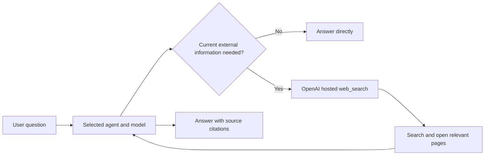

# Web Research

rdma26 uses OpenAI's provider-hosted web search as its normal internet-search capability. There is no separate research agent or research model.

## Configuration

Grant the `web_search` capability to an agent through the UI, API, or CLI. The capability uses the model selected for that chat run and works with configured OpenAI API models or supported ChatGPT/Codex models.

```bash
./bin/rdma26 agents:tools:grant --agent ronaldo --tool web_search
```

Agents without this grant cannot search the internet. The grant is not enabled automatically for newly created agents.

## Runtime Flow



OpenAI formulates search queries, searches, opens pages when needed, and returns
citation annotations. rdma26 requests provider-reported search sources as
response metadata and stores them together with final-answer citations. This
preserves source URLs in run context and the UI even when a model omits citation
annotations from its final prose.

## Skill Guidance

Every agent receives the built-in `web-research` Deep Agents skill. It provides reusable guidance to:

- identify the exact fact requested before searching;
- distinguish publication, event, release, scheduled, live, and completed dates or states;
- prefer primary and authoritative sources;
- use local-language or regional sources when broad sources are incomplete;
- continue only when evidence is stale, incomplete, ambiguous, or conflicting;
- compare dated candidates for latest, last, and next questions;
- preserve citations and state remaining uncertainty plainly;
- handle news and developing events with explicit dates, event-date checks,
  regional and local-language sources, and focused follow-up searches when broad
  results are noisy. A request about today must not silently fall back to an
  older recent story, and factual details should cite direct reports rather than
  publisher homepages.

This is reusable operating guidance, not a hardcoded workflow for one question type.

Deep Agents first injects only the skill name and description. When the model
decides the skill matches a request, it reads
`/skills/web-research/SKILL.md` through progressive disclosure. Run context
records that file read under `skillsUsed`; merely having the skill available is
not reported as usage.

## Known-URL Readers

`read_web_page` and `read_web_page_structure` remain optional low-level tools for cases where the target URL is already known. They are not search providers:

- `read_web_page` returns readable page text;
- `read_web_page_structure` returns focused tables, headings, links, lists, Markdown, or article content.

These readers use local HTTP fetching and reject localhost and private-network URLs.

## Streaming And Observability

Chat still streams run activity and the final answer through SSE. The current Deep Agents event stream does not preserve all hosted-search citation metadata, so hosted-search runs use the final invocation result to capture search actions and citations reliably. LLM calls remain routed through the accounting-aware model factory.

Research quality, calls, tokens, context size, cost, and latency are measured by the `research` evaluation suite described in [evaluation.md](./evaluation.md).
