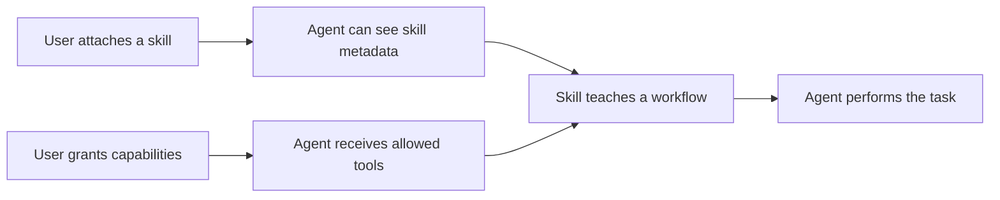
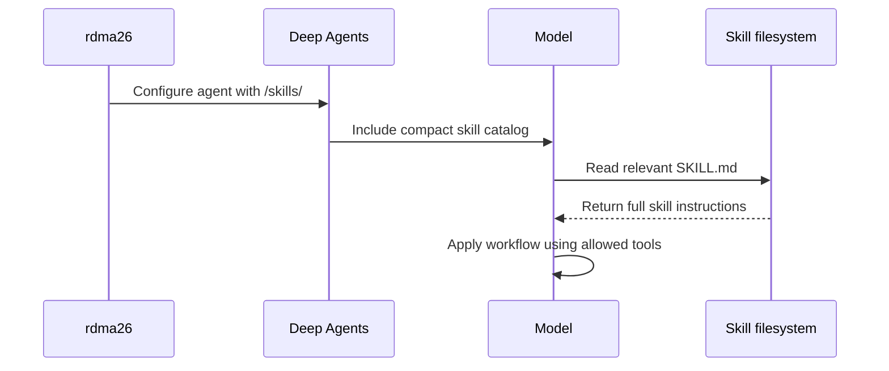
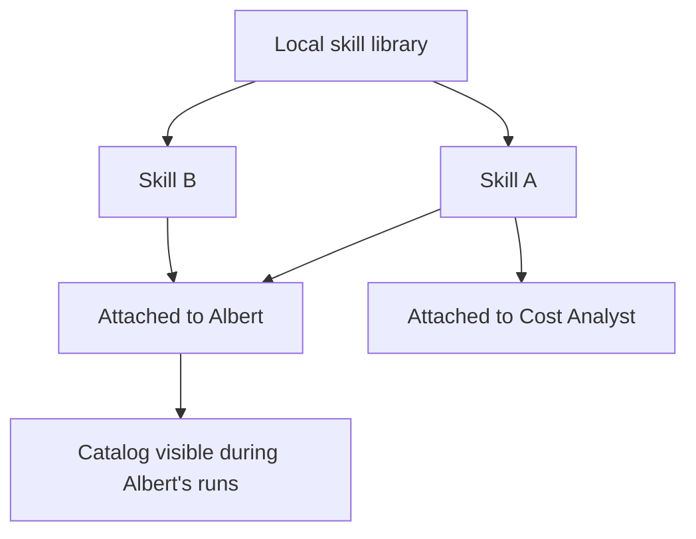
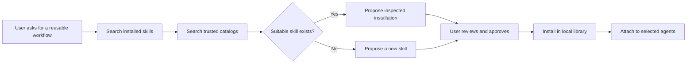

# Skills

A skill teaches an agent how to perform a reusable kind of work. It can contain
workflow guidance, domain knowledge, examples, templates, and supporting files.
A skill does not perform an operation by itself and does not give an agent new
permissions.

For example, a pricing-analysis skill can tell an agent which sources to prefer,
which checks to perform, and how to present the result. The agent still needs
the appropriate capabilities and tools to read those sources or update pricing
records.

This document is the canonical description of skills in rdma26. It separates
the behavior implemented today from the management model we intend to build.

## Skills, Capabilities, And Tools

These concepts have different jobs:

| Concept        | Purpose                                                                                  | Example                            |
| -------------- | ---------------------------------------------------------------------------------------- | ---------------------------------- |
| **Capability** | Grants a meaningful agent ability or authorization and may configure several mechanisms. | `web_page_access`                  |
| **Tool**       | Performs one concrete operation the model can call.                                      | `read_web_page`                    |
| **Skill**      | Teaches a reusable approach to a task using abilities the agent already has.             | A pricing-source analysis workflow |

A skill can recommend tools, but it cannot make an unavailable tool appear. It
cannot grant a capability, bypass memory permissions, or broaden filesystem or
network access.



## Open Skill Format

rdma26 uses the open [Agent Skills specification](https://agentskills.io/specification)
as its package format. A skill is a directory whose entry point is `SKILL.md`.
The file begins with metadata containing at least a name and a short
description, followed by the instructions the agent should follow. The
directory may also contain standard supporting directories such as `scripts/`,
`references/`, and `assets/`.

The description matters because it helps the model decide whether the skill is
relevant before loading the complete instructions. Instructions should explain
when to use the skill, the workflow to follow, important constraints, and the
expected result. They should not contain credentials or try to override the
agent's permissions.

Using the open format allows rdma26 to reuse compatible skills created for
other agent systems. OpenClaw, Anthropic Agent Skills, and OpenAI/Codex skills
all use this core directory and `SKILL.md` structure. Their complete runtime
behavior is not identical, however. Vendor-specific metadata, tool names,
execution environments, plugins, and hosted skill ids require compatibility
inspection rather than blind installation.

Examples of reusable sources include:

- [ClawHub and OpenClaw skill packages](https://docs.openclaw.ai/tools/skills);
- [Anthropic's public skills repository](https://github.com/anthropics/skills);
- [OpenAI/Codex skills and skill-bearing plugins](https://learn.chatgpt.com/docs/build-skills);
- any local directory, archive, or Git source that contains a valid Agent
  Skills package.

Provider-hosted skills are not automatically portable. For example, an
Anthropic API skill identified only by a hosted `skill_id` depends on
Anthropic's code-execution container. rdma26 can import a downloadable Agent
Skills package, but it cannot treat a provider-only identifier as local files.

## Current Implementation

Skills are currently stored separately for each agent:

```text
.assistant-data/agents/<agent-id>/deepagent/skills/<skill-id>/SKILL.md
```

When rdma26 creates a Deep Agent, it exposes that agent's `/skills/` directory
through the Deep Agents filesystem. Deep Agents initially gives the model a
compact catalog containing each skill's name, description, and path. The full
`SKILL.md` content is not loaded at that point.

If the model decides a skill is useful, it reads the corresponding `SKILL.md`.
The complete instructions then become part of the conversation state for later
model calls in that run. This behavior is called **progressive disclosure**: the
agent can discover available skills without paying the context cost of every
skill body on every request.



The current implementation has these limits:

- There is no shared skill library.
- There is no skill-management API, CLI, or settings page.
- A skill present in an agent's directory is automatically available to that
  agent; there is no separate attachment record.
- rdma26 does not yet validate or safely edit arbitrary skill packages.
- Only the protected Cost Analyst currently receives a bundled skill,
  `pricing-source-analysis`.

That bundled skill is written into the Cost Analyst's agent directory by the
backend. It guides pricing-source analysis and works with the Cost Analyst's
protected pricing tools. Other agents currently have no bundled skills.

## What The Run Inspector Records

A skill being listed in the catalog does not mean it was used. rdma26 records a
skill as used only when it observes the agent reading that skill's `SKILL.md`.
The run inspector then shows the skill name and its virtual path under **Skills
used**.

This is useful evidence that the full instructions were loaded. It does not
prove that every instruction was followed, and reads of supporting files are
not currently summarized as separate skill usage.

## Planned Management Model

The lasting product model has two levels:

1. A skill is **installed** once in a reusable local skill library.
2. A skill is **attached** to any agent that should be able to use it.

An attached skill is available to the agent, but its complete instructions are
still loaded only when relevant. Detaching a skill from one agent does not
delete it from the library or affect other agents.



The library will distinguish ownership:

- **Bundled skills** ship with rdma26. They are visible and attachable but
  cannot be overwritten or deleted. A user may clone one to customize it.
- **User skills** are created locally. They can be edited, attached, detached,
  and deleted by the user.
- **Installed external skills** come from a local package, Git source, or
  catalog. Their original content is read-only, their provenance and version
  remain visible, and a user clones one before customizing it.

The application should store user-managed packages under a shared local skills
directory and store agent attachments as configuration, rather than copying a
separate editable package into every agent. The runtime may mount or materialize
attached packages into the agent's virtual `/skills/` path, but that is an
implementation detail and should not become a user-facing concept.

Concretely, the planned persisted model is:

- bundled packages are versioned application resources;
- user packages live under `.assistant-data/skills/user/<skill-id>/`;
- external packages live under `.assistant-data/skills/external/<skill-id>/`;
- each agent profile stores an `attachedSkills` list of stable skill ids;
- a skill-library service combines package metadata with installation records,
  ownership, provenance, versions, hashes, and compatibility reports;
- the runtime resolves `attachedSkills` into the virtual skill directories
  supplied to Deep Agents.

The service is the single owner of library and attachment changes. API routes,
CLI commands, and Angular screens must call that service through
`AssistantRuntime`. Its operations cover listing, reading, creating, updating,
cloning, and deleting library skills, plus listing, attaching, and detaching
skills for an agent.

## Installing Existing Skills

Reusing an existing skill is preferable to creating another copy of the same
workflow. The first skill-management release therefore includes installation,
not only local authoring.

The library accepts these sources:

- a local skill directory;
- a local archive containing one skill package;
- a Git repository, subdirectory, and optional revision;
- ClawHub through a catalog adapter;
- curated Anthropic or OpenAI/Codex packages when they are available as normal
  Agent Skills files through one of the supported sources.

Additional catalogs use adapters over the same installation service. A catalog
adapter searches and retrieves package metadata; it does not get a separate
storage format or bypass validation.

Every external installation records:

- source type, source URL, and package path;
- resolved revision or version;
- content hash;
- author and license metadata when available;
- installation and update timestamps;
- validation and compatibility results.

rdma26 preserves the downloaded package instead of silently rewriting its
instructions. Product-specific compatibility mappings belong in a separate
installation record. Updates are explicit, show the proposed version and
changes, rerun validation, and require approval. A skill may be pinned to its
installed version.

### Compatibility Inspection

The common file format does not guarantee that a skill can run correctly. An
imported package may expect OpenClaw's `exec` or browser tools, Claude's hosted
code-execution container, Codex filesystem tools, an MCP server, environment
variables, command-line programs, network access, or vendor-specific metadata.

The installer reports one of these states before approval:

- **Compatible**: its instructions and known requirements are supported.
- **Instructions only**: its guidance can be used, but included scripts cannot
  run in the current rdma26 runtime.
- **Missing capabilities**: it expects operations that the selected agent has
  not been granted.
- **Unsupported runtime**: it depends on provider-hosted or vendor-specific
  behavior that rdma26 cannot supply.
- **Unsafe or invalid**: installation is blocked.

Attaching a skill with missing capabilities does not grant them. The UI may
offer a separate capability-grant action, but that action requires its own
approval. Scripts remain ordinary package files until a future sandbox
capability provides an explicitly approved execution path.

## Scripts, Tools, And Plugins

A skill package may contain scripts, but a script is not automatically a
model-callable tool. Systems with a general execution tool can make this look
seamless: the skill teaches the agent to run its script through an already
available shell or sandbox. rdma26 does not currently have that general
execution environment, and the QuickJS interpreter is not a substitute for it.

The future sandbox capability may execute an attached skill's scripts with
explicit filesystem, network, package, time, and resource limits. Until then,
the installer may classify a script-bearing skill as **Instructions only**.
Installing or attaching the skill never enables script execution by itself.

A genuine typed tool remains a separate runtime extension. It may come from an
rdma26 capability, a future plugin package, or an explicitly configured MCP
server. An agent may eventually propose such an executable extension, but code
review, tests, installation, capability assignment, credentials, and activation
require approvals separate from skill approval.

Some OpenAI/Codex or OpenClaw distribution packages bundle skills together with
plugins, connectors, or MCP configuration. The skill installer imports only the
standard skill packages and reports the other components as dependencies. It
does not silently install or enable them.

## Agent-Assisted Skill Management

Users should be able to manage skills conversationally as well as through the
settings UI. rdma26 provides two separate, configurable capabilities because
local authoring and external software acquisition have different trust
boundaries.

### `skill_authoring`

The **Skill authoring** capability lets an agent draft new skills and revisions
to user-owned skills. It contributes authoring guidance and proposal tools such
as:

- `propose_skill_create`;
- `propose_skill_update`;
- `list_skill_proposals`;
- `inspect_skill_proposal`.

A proposal can contain `SKILL.md`, standard supporting files, declared tool or
capability requirements, and the conversation evidence that motivated it. The
agent cannot apply the proposal, attach the skill, grant capabilities, execute
scripts, overwrite bundled or external skills, or install a tool plugin.

### `skill_acquisition`

The **Skill acquisition** capability lets an agent find and evaluate existing
skills before inventing a new one. It contributes catalog guidance and proposal
tools such as:

- `search_skill_catalogs`;
- `inspect_skill_package`;
- `compare_skill_candidates`;
- `check_skill_compatibility`;
- `propose_skill_install`.

It may inspect configured trusted catalogs and sources, but it cannot complete
an installation or approve dependencies. When both skill capabilities are
enabled, shared guidance requires the agent to search installed skills and
trusted catalogs before proposing a new skill.

Both capabilities are disabled by default for ordinary agents and can be
enabled independently in agent settings. The protected operator agent may
receive them by default, but proposal approval remains a user action.



Applying a proposal is the only operation that changes the active library. A
proposal records its target and content hashes so it becomes stale if its
source or target changes before approval. Invalid proposals are rejected, and
suspicious proposals can be quarantined for inspection.

## Planned User Experience

The agent editor will gain a **Skills** section that shows the skills attached
to that agent. From there, a user should be able to:

- attach an installed skill;
- detach a skill without deleting it;
- open a skill to inspect its description, ownership, source, and files;
- create a user skill;
- edit or delete a user-owned skill;
- clone a bundled or external skill before customizing it.

A separate library view should manage all installed skills. The UI must clearly
distinguish **installed**, **attached**, and **used**:

- **Installed** means the package exists in the local library.
- **Attached** means the selected agent can discover it.
- **Used** means the agent loaded its `SKILL.md` during a particular run.

The library view also supports searching configured catalogs, installing from
local files or Git, inspecting source and compatibility details, checking for
updates, pinning a version, and uninstalling an unattached external skill.
Skill proposals appear in a review queue with their generated files, evidence,
security findings, compatibility report, and exact changes.

The editor should warn when a skill describes tools or capabilities that the
agent does not have, but attaching the skill must never grant those abilities
implicitly.

## Validation And Safety

Before a skill can enter the library, rdma26 should validate that:

- the package has one valid `SKILL.md` entry point;
- required metadata is present and uses a stable skill id;
- all paths remain inside the package directory;
- file types and package size stay within explicit limits;
- archives cannot escape their extraction directory and symlinks cannot target
  untrusted paths;
- credentials and environment secrets are not stored by the skill-management
  workflow;
- external source, revision, hash, license, and ownership metadata are retained;
- unexpected network calls, executable content, and dangerous instruction
  patterns produce findings or block installation according to policy;
- scripts are treated as files, not automatically granted execution rights;
- bundled files cannot be modified through user-skill operations.

Skill instructions remain subordinate to the agent's system instructions,
capability grants, memory permissions, and protected-tool rules.

## Implementation Sequence

The management feature should be implemented in reviewable stages:

1. Add an Agent Skills-compatible library service, package validation,
   provenance records, ownership metadata, version pinning, compatibility
   inspection, and agent attachment persistence.
2. Add local-directory, archive, and Git installation, followed by a ClawHub
   catalog adapter. Verify representative public Anthropic and OpenAI/Codex
   packages through those common source paths.
3. Expose the same typed library, installation, proposal, and attachment
   operations through `AssistantRuntime`, API, and CLI.
4. Resolve attached library skills into each agent's virtual `/skills/`
   directory and add focused runtime and migration tests.
5. Implement `skill_authoring` and `skill_acquisition` with proposal-only tools,
   validation, stale-target detection, scanning, quarantine, and explicit apply.
6. Add the Skills section to the agent editor and a library view with catalog
   search, install, update, pin, attach, detach, create, inspect, edit, clone,
   proposal review, and delete flows.
7. Extend run observability with installed and attached skill metadata while
   preserving the existing evidence of skills actually loaded.
8. Add behavioral evaluations proving that agents prefer suitable existing
   skills, relevant skills are selected, irrelevant skills stay unloaded, and
   skills cannot bypass capability or permission boundaries.

Migration must preserve existing local data. The Cost Analyst's current
`pricing-source-analysis` directory becomes an attachment to the bundled
version. Any other valid skill found in an agent-local directory must be
imported as a user skill and attached to that agent. Migration must not delete
the old package until the library copy and attachment have been verified, and
name collisions must produce a clear migration error rather than silently
overwriting either package.

## Acceptance Criteria

The first complete skill-management release is ready when:

- users can manage local user skills without editing `.assistant-data` by hand;
- rdma26 validates the core Agent Skills format rather than introducing a
  private skill format;
- users can install from a local package or Git source and search at least one
  curated external catalog;
- external skills retain source, version, hash, license, compatibility, and
  update information;
- one installed skill can be attached to several agents without package copies;
- bundled and external skills are protected and cloneable;
- API, CLI, and UI use the same backend service and terminology;
- only attached skills appear in an agent's catalog;
- attaching a skill never grants a capability or tool;
- selected agents can propose skill creation, revision, or installation through
  independently configurable capabilities;
- no proposal changes the active library without explicit approval;
- the agent searches installed skills and trusted catalogs before creating a
  duplicate workflow when both management capabilities are enabled;
- run details distinguish attached skills from skills actually loaded;
- invalid or unsafe packages are rejected with a clear explanation;
- existing Cost Analyst behavior survives migration.
