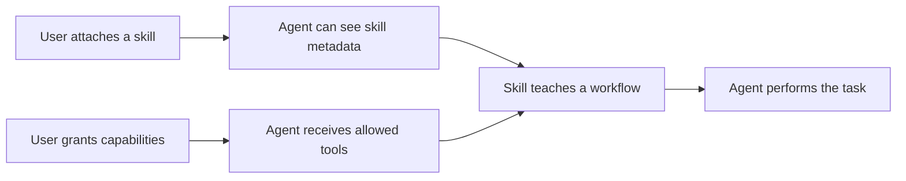
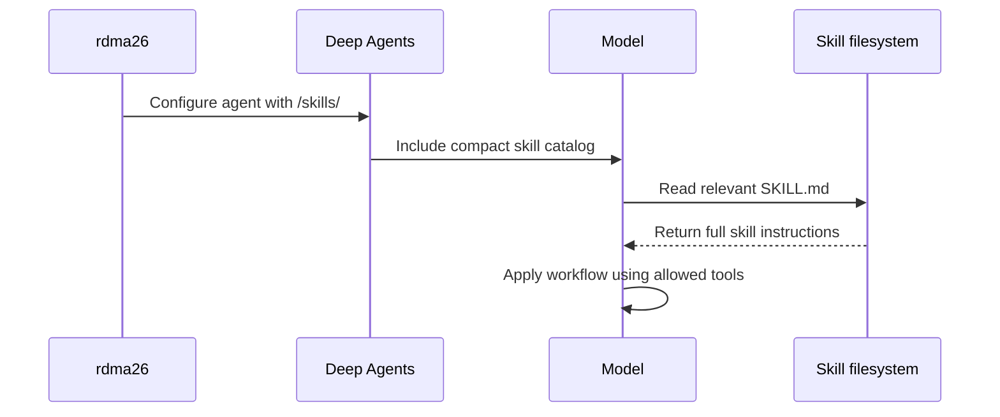
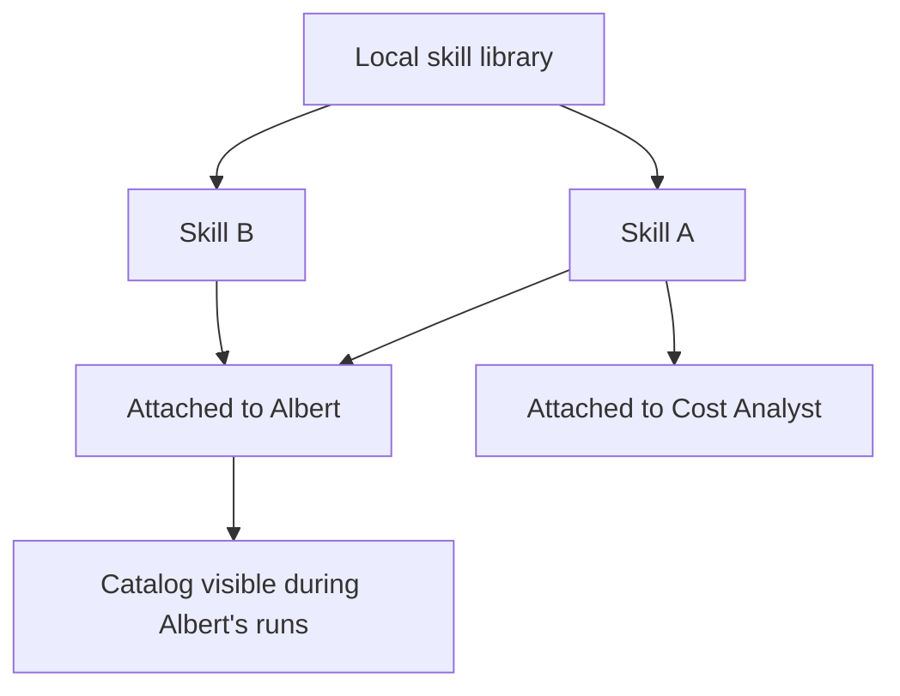

# Skills

A skill teaches an agent how to perform a reusable kind of work. It can contain
workflow guidance, domain knowledge, examples, templates, and supporting files.
A skill does not perform an operation by itself and does not give an agent new
permissions.

For example, a pricing-analysis skill can tell an agent which sources to prefer,
which checks to perform, and how to present the result. The agent still needs
the appropriate capabilities and tools to read those sources or update pricing
records.

This document is the canonical description of skills in rdma26. It separates
the behavior implemented today from the management model we intend to build.

## Skills, Capabilities, And Tools

These concepts have different jobs:

| Concept        | Purpose                                                                                  | Example                            |
| -------------- | ---------------------------------------------------------------------------------------- | ---------------------------------- |
| **Capability** | Grants a meaningful agent ability or authorization and may configure several mechanisms. | `web_page_access`                  |
| **Tool**       | Performs one concrete operation the model can call.                                      | `read_web_page`                    |
| **Skill**      | Teaches a reusable approach to a task using abilities the agent already has.             | A pricing-source analysis workflow |

A skill can recommend tools, but it cannot make an unavailable tool appear. It
cannot grant a capability, bypass memory permissions, or broaden filesystem or
network access.



## Skill Package

A Deep Agents-compatible skill is a directory whose entry point is
`SKILL.md`. The file begins with metadata containing at least a name and a short
description, followed by the instructions the agent should follow. The
directory may also contain references, templates, examples, scripts, or other
supporting files.

The description matters because it helps the model decide whether the skill is
relevant before loading the complete instructions. Instructions should explain
when to use the skill, the workflow to follow, important constraints, and the
expected result. They should not contain credentials or try to override the
agent's permissions.

## Current Implementation

Skills are currently stored separately for each agent:

```text
.assistant-data/agents/<agent-id>/deepagent/skills/<skill-id>/SKILL.md
```

When rdma26 creates a Deep Agent, it exposes that agent's `/skills/` directory
through the Deep Agents filesystem. Deep Agents initially gives the model a
compact catalog containing each skill's name, description, and path. The full
`SKILL.md` content is not loaded at that point.

If the model decides a skill is useful, it reads the corresponding `SKILL.md`.
The complete instructions then become part of the conversation state for later
model calls in that run. This behavior is called **progressive disclosure**: the
agent can discover available skills without paying the context cost of every
skill body on every request.



The current implementation has these limits:

- There is no shared skill library.
- There is no skill-management API, CLI, or settings page.
- A skill present in an agent's directory is automatically available to that
  agent; there is no separate attachment record.
- rdma26 does not yet validate or safely edit arbitrary skill packages.
- Only the protected Cost Analyst currently receives a bundled skill,
  `pricing-source-analysis`.

That bundled skill is written into the Cost Analyst's agent directory by the
backend. It guides pricing-source analysis and works with the Cost Analyst's
protected pricing tools. Other agents currently have no bundled skills.

## What The Run Inspector Records

A skill being listed in the catalog does not mean it was used. rdma26 records a
skill as used only when it observes the agent reading that skill's `SKILL.md`.
The run inspector then shows the skill name and its virtual path under **Skills
used**.

This is useful evidence that the full instructions were loaded. It does not
prove that every instruction was followed, and reads of supporting files are
not currently summarized as separate skill usage.

## Planned Management Model

The lasting product model has two levels:

1. A skill is **installed** once in a reusable local skill library.
2. A skill is **attached** to any agent that should be able to use it.

An attached skill is available to the agent, but its complete instructions are
still loaded only when relevant. Detaching a skill from one agent does not
delete it from the library or affect other agents.



The library will distinguish ownership:

- **Bundled skills** ship with rdma26. They are visible and attachable but
  cannot be overwritten or deleted. A user may clone one to customize it.
- **User skills** are created locally. They can be edited, attached, detached,
  and deleted by the user.
- **Installed external skills** may be supported later. Their source and version
  must remain visible, and installation must use the same validation rules as a
  user skill.

The application should store user-managed packages under a shared local skills
directory and store agent attachments as configuration, rather than copying a
separate editable package into every agent. The runtime may mount or materialize
attached packages into the agent's virtual `/skills/` path, but that is an
implementation detail and should not become a user-facing concept.

Concretely, the planned persisted model is:

- bundled packages are versioned application resources;
- user packages live under `.assistant-data/skills/user/<skill-id>/`;
- each agent profile stores an `attachedSkills` list of stable skill ids;
- a skill-library service combines package metadata with ownership and source
  information;
- the runtime resolves `attachedSkills` into the virtual skill directories
  supplied to Deep Agents.

The service is the single owner of library and attachment changes. API routes,
CLI commands, and Angular screens must call that service through
`AssistantRuntime`. Its operations cover listing, reading, creating, updating,
cloning, and deleting library skills, plus listing, attaching, and detaching
skills for an agent.

## Planned User Experience

The agent editor will gain a **Skills** section that shows the skills attached
to that agent. From there, a user should be able to:

- attach an installed skill;
- detach a skill without deleting it;
- open a skill to inspect its description, ownership, source, and files;
- create a user skill;
- edit or delete a user-owned skill;
- clone a bundled skill before customizing it.

A separate library view should manage all installed skills. The UI must clearly
distinguish **installed**, **attached**, and **used**:

- **Installed** means the package exists in the local library.
- **Attached** means the selected agent can discover it.
- **Used** means the agent loaded its `SKILL.md` during a particular run.

The editor should warn when a skill describes tools or capabilities that the
agent does not have, but attaching the skill must never grant those abilities
implicitly.

## Validation And Safety

Before a skill can enter the library, rdma26 should validate that:

- the package has one valid `SKILL.md` entry point;
- required metadata is present and uses a stable skill id;
- all paths remain inside the package directory;
- file types and package size stay within explicit limits;
- credentials and environment secrets are not stored by the skill-management
  workflow;
- scripts are treated as files, not automatically granted execution rights;
- bundled files cannot be modified through user-skill operations.

Skill instructions remain subordinate to the agent's system instructions,
capability grants, memory permissions, and protected-tool rules.

## Implementation Sequence

The management feature should be implemented in reviewable stages:

1. Add a skill-library service, package validation, ownership metadata, and
   agent attachment persistence.
2. Expose the same typed operations through `AssistantRuntime`, API, and CLI.
3. Resolve attached library skills into each agent's virtual `/skills/`
   directory and add focused runtime and migration tests.
4. Add the Skills section to the agent editor and a library view with attach,
   detach, create, inspect, edit, clone, and delete flows.
5. Extend run observability with installed and attached skill metadata while
   preserving the existing evidence of skills actually loaded.
6. Add behavioral evaluations proving that relevant skills are selected,
   irrelevant skills stay unloaded, and skills cannot bypass capability or
   permission boundaries.

External repositories or marketplaces are deliberately outside the first
implementation. The local library and ownership rules should be stable before
remote installation is introduced.

Migration must preserve existing local data. The Cost Analyst's current
`pricing-source-analysis` directory becomes an attachment to the bundled
version. Any other valid skill found in an agent-local directory must be
imported as a user skill and attached to that agent. Migration must not delete
the old package until the library copy and attachment have been verified, and
name collisions must produce a clear migration error rather than silently
overwriting either package.

## Acceptance Criteria

The first complete skill-management release is ready when:

- users can manage local user skills without editing `.assistant-data` by hand;
- one installed skill can be attached to several agents without package copies;
- bundled skills are protected and cloneable;
- API, CLI, and UI use the same backend service and terminology;
- only attached skills appear in an agent's catalog;
- attaching a skill never grants a capability or tool;
- run details distinguish attached skills from skills actually loaded;
- invalid or unsafe packages are rejected with a clear explanation;
- existing Cost Analyst behavior survives migration.
